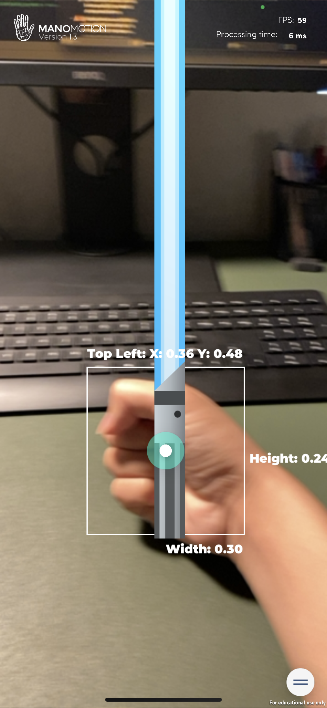

# Unity-ARFoundation-echoAR-demo-Traveling-Demo
A traveling Demo created with Unity, ManoMotion and echoAR.

## Register
If you don't have an echoAR API key yet, make sure to register for FREE at [echoAR](https://console.echoar.xyz/#/auth/register).

## Setup
* Create a new Unity project.
* Clone the [Unity-ARFoundation-echoAR](https://github.com/echoARxyz/Unity-ARFoundation-echoAR) sample code.
* Clone this repository for prefabs,scenes and custom scripts.
* Follow the instructions on our [doumention page](https://docs.echoar.xyz/unity/adding-ar-capabilities) to [set your API key](https://docs.echoar.xyz/unity/adding-ar-capabilities#3-set-you-api-key).
* Set your echoAR API key in the echoAR prefab
* Add the models from the models folder to the echoAR console
* For each model, add the corresponding metadata from the metadata folder on the echoAR console
* Overwrite the existing echoAR/CustomBehaviour.cs script with the new _CustomBehaviour.cs_ file
* Set up a ManoMotion account and follow instructions on their website

## Run
* [Build and run the AR application](https://docs.echoar.xyz/unity/adding-ar-capabilities#4-build-and-run-the-ar-application).

## Known issues
* Due to the limitations of the software & hardware we use, the application might freeze sometimes. Wait for it to load first, and if it freezes for over 10s, click run again from Xcode.
* The developer hasn't been able to use the estimated depth data of the hand, so they put the lightsaber object at a fixed distance in front of the camera as a temporary solution. This feature might be added later.

## Learn more
Refer to our [documentation](https://docs.echoar.xyz/unity/) to learn more about how to use Unity, AR Foundation, and echoAR.

## Support
Feel free to reach out at [support@echoAR.xyz](mailto:support@echoAR.xyz) or join our [support channel on Slack](https://join.slack.com/t/echoar/shared_invite/enQtNTg4NjI5NjM3OTc1LWU1M2M2MTNlNTM3NGY1YTUxYmY3ZDNjNTc3YjA5M2QyNGZiOTgzMjVmZWZmZmFjNGJjYTcxZjhhNzk3YjNhNjE). 

## Screenshots

